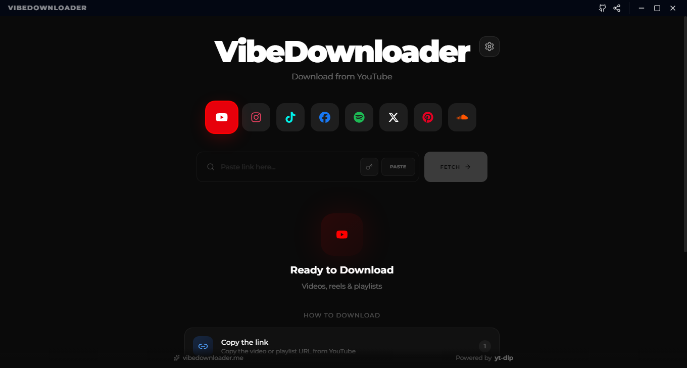
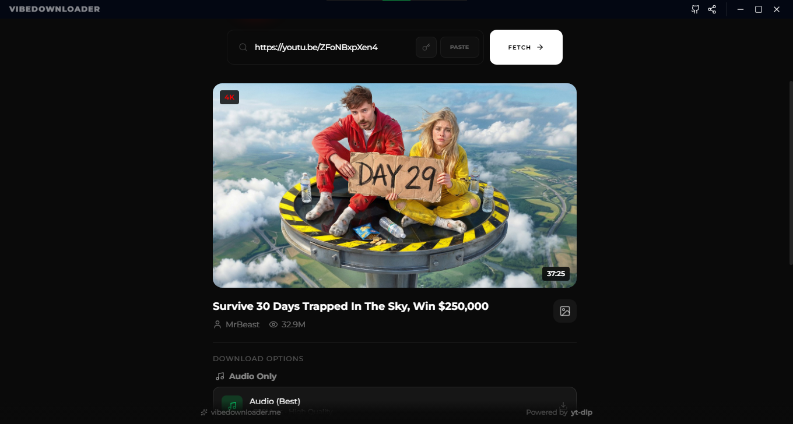
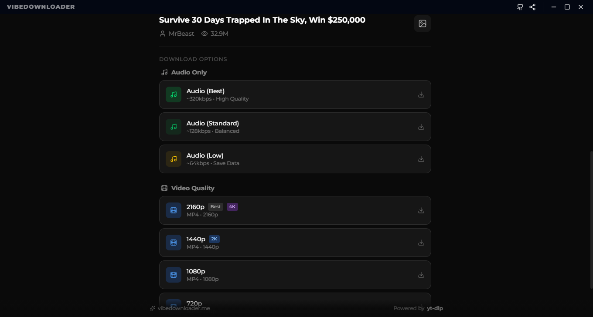
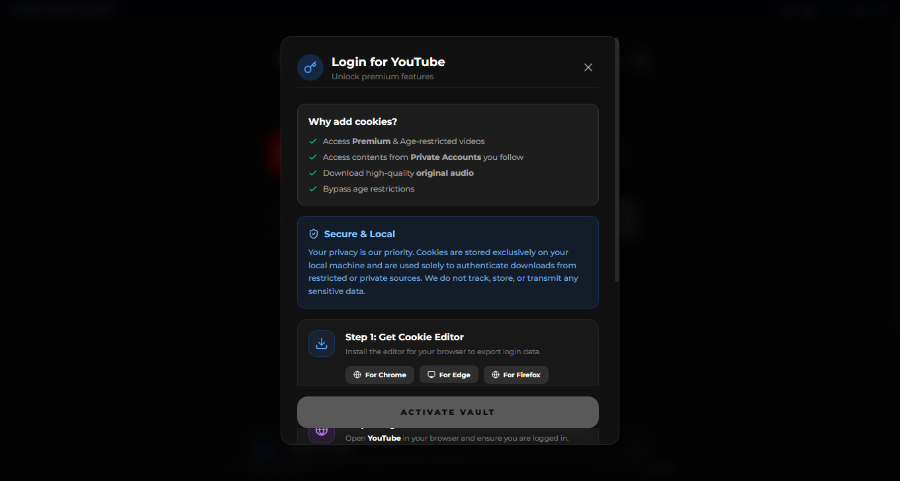
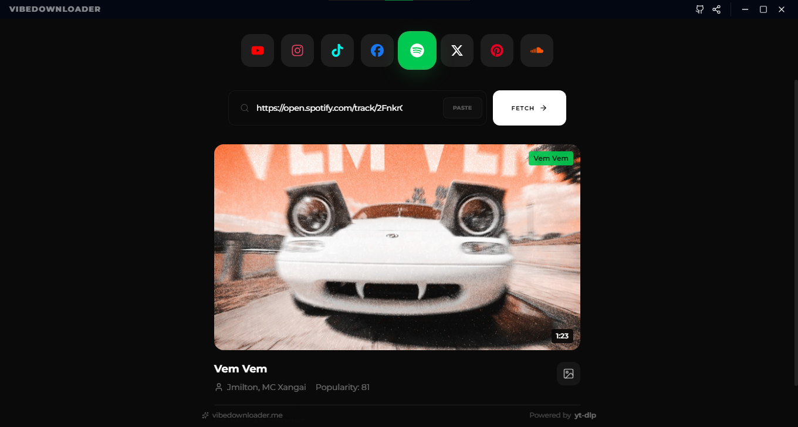
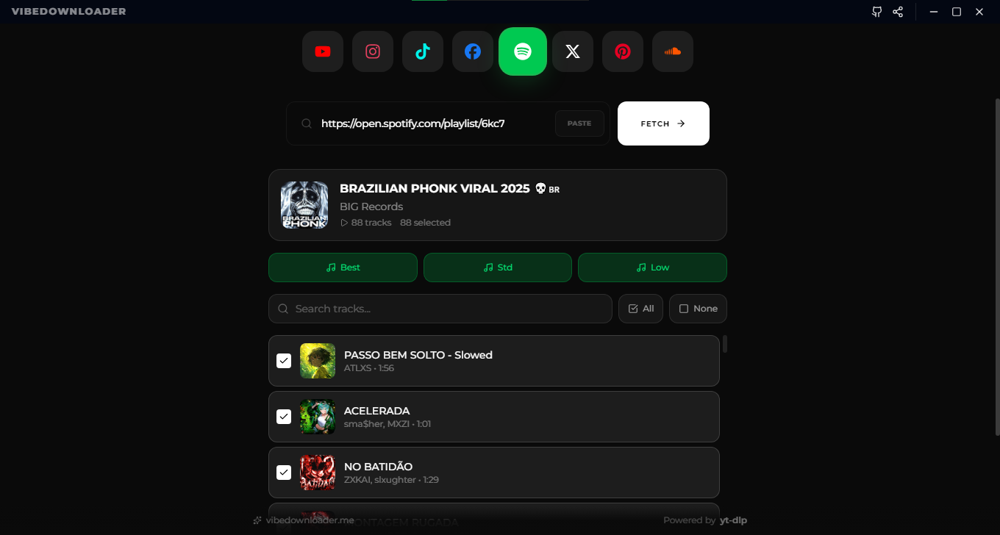
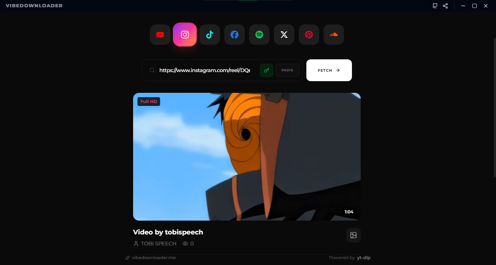
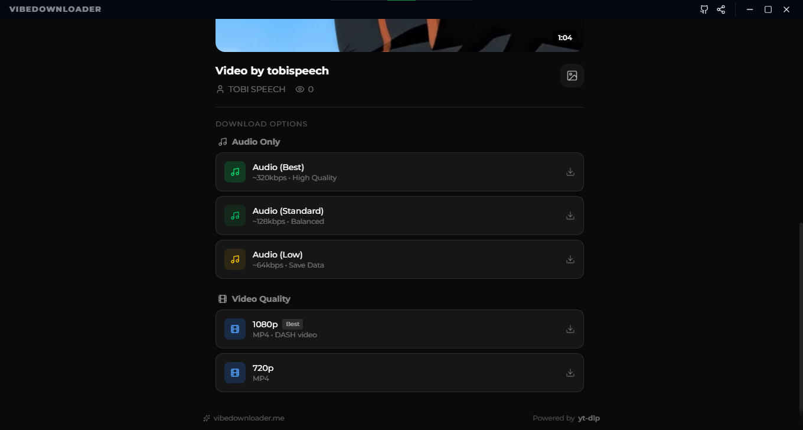

<div align="center">
  <a href="https://github.com/naeem5877/vibedownloader-desktop">
    
  </a>
  <br />
  <br />

  <h1>VibeDownloader</h1>
  
  <p>
    <strong>An open-source desktop video downloader for Windows, macOS, and Linux.</strong>
  </p>
  
  <p>
    Download videos, audio, and playlists from YouTube, Instagram, TikTok, Spotify, and more — locally, ad-free, and privacy-first.
  </p>

  <p>
    <a href="https://github.com/naeem5877/vibedownloader-desktop">
      
    </a>
    <a href="https://vibedownloader.me">
      
    </a>
  </p>

  <p>
    <a href="https://github.com/naeem5877/vibedownloader-desktop/releases/latest">
      
    </a>
    <a href="https://github.com/naeem5877/vibedownloader-desktop/actions">
      
    </a>
    <a href="https://github.com/naeem5877/vibedownloader-desktop/releases">
      
    </a>
  </p>
</div>

<br />

---

## 🌟 Why VibeDownloader?

VibeDownloader is designed for users who value **control, speed, and privacy**.

Unlike web-based downloaders cluttered with ads and trackers, VibeDownloader runs **entirely on your machine**, powered by the industry-standard `yt-dlp` engine.

<div align="center">

### 🚫 No Accounts • 🔒 No Tracking • ✨ No Nonsense

</div>

---

## ✨ Key Features

<table>
<tr>
<td width="50%">

### 🎥 Multi-Platform Support
Download from YouTube, Instagram (Reels, Stories, Posts), TikTok, Facebook, X (Twitter), Pinterest, and SoundCloud

### 🎵 Spotify Downloads
Get tracks, albums, and playlists complete with metadata and cover art

### 📦 Batch Downloading
Queue multiple videos or audio tracks at once with individual format controls and seamless processing

### ⚡ Fast & Efficient
Multi-threaded downloads for maximum speed

</td>
<td width="50%">

### 💎 Modern UI
Clean dark mode interface with smooth animations

### 🔐 Privacy-First
Runs locally with no server-side processing

### 📦 Smart Organization
Auto-sorted folders by platform and content type

### 🛑 Ad-Free Experience
No ads, no popups, no tracking

</td>
</tr>
</table>

---

## 🖼️ Screenshots

<div align="center">
  
  
  <br />
  <br />
  
  
  <br />
  <br />
  
  
  <br />
  <br />
  
  
</div>

---

## 📥 Download & Installation

<div align="center">

### Choose Your Platform

</div>

### 💻 Windows

1. Download the `.exe` installer from the [**Releases page**](https://github.com/naeem5877/vibedownloader-desktop/releases/latest)
2. Run the installer and follow the setup wizard
3. Launch VibeDownloader from your Start Menu

---

### 🍎 macOS

1. Download the `.dmg` file from the [**Releases page**](https://github.com/naeem5877/vibedownloader-desktop/releases/latest)
2. Open the downloaded `.dmg` file
3. Drag **VibeDownloader** to your Applications folder
4. Open the app from Applications

#### ⚠️ macOS Security Notice (Important)

macOS may display a warning: **"VibeDownloader is damaged and can't be opened"**.  

This occurs because the app is not yet signed with an Apple Developer ID ($99/year requirement).

**Quick Fix (one-time command):**

```bash
xattr -c /Applications/VibeDownloader.app
```

Then open the app normally from your Applications folder.

> **Note:** This command only removes macOS quarantine flags. The app is fully open source — you can inspect the entire codebase before running it.

---

### 🐧 Linux

Download the `.AppImage` or `.deb` package from the [**Releases page**](https://github.com/naeem5877/vibedownloader-desktop/releases/latest)

#### For AppImage:

```bash
# Make it executable
chmod +x VibeDownloader-x.x.x.AppImage

# Run it
./VibeDownloader-x.x.x.AppImage
```

#### For Debian/Ubuntu (.deb):

```bash
sudo dpkg -i VibeDownloader-x.x.x.deb
```

---

## 🛠️ For Developers

Built with modern web technologies: **Electron**, **React**, **Vite**, and **TypeScript**.

### Setup Development Environment

```bash
# Clone the repository
git clone https://github.com/naeem5877/vibedownloader-desktop.git

# Navigate to the project directory
cd vibedownloader-desktop

# Install dependencies
npm install

# Start development server
npm run dev
```

### Build Commands

```bash
# Build for Windows
npm run pack:win

# Build for macOS
npm run pack:mac

# Build for Linux
npm run pack:linux
```

### Project Structure

```
vibedownloader-desktop/
├── src/              # Source code
├── public/           # Static assets
├── electron/         # Electron main process
├── Screenshots/      # App screenshots
└── dist/            # Build output
```

---

## 🤝 Contributing

Contributions are welcome and appreciated! Here's how you can help:

1. **Fork** the repository
2. Create a **feature branch** (`git checkout -b feature/amazing-feature`)
3. **Commit** your changes (`git commit -m 'Add some amazing feature'`)
4. **Push** to the branch (`git push origin feature/amazing-feature`)
5. Open a **Pull Request**

Please follow our [Code of Conduct](CODE_OF_CONDUCT.md) and coding standards.

### Areas We'd Love Help With:

- 🐛 Bug fixes and stability improvements
- 🌐 Translation and internationalization
- 📝 Documentation improvements
- ✨ New feature development
- 🎨 UI/UX enhancements

---

## 📄 License & Brand Usage

### Code License

This project is licensed under the **GNU GPL v3.0**.

You are free to:
- ✅ View the source code
- ✅ Modify the code
- ✅ Distribute modified versions

**Under the condition that:**
- 📋 You disclose the source code
- 📋 State all changes made
- 📋 Use the same GPL v3.0 license

See the [LICENSE](LICENSE) file for full details.

### Brand Notice

⚠️ **The VibeDownloader name, logo, and branding are reserved.**

If you create a fork or modified version:
- ❌ Must **NOT** use the "VibeDownloader" name
- ❌ Must **NOT** use the official logo
- ❌ Must **NOT** present itself as an official build

**Why?** This helps users distinguish official releases from community forks and ensures trust in the brand.

---

## 📞 Support & Community

<div align="center">

[](https://github.com/naeem5877/vibedownloader-desktop/issues)
[](https://github.com/naeem5877/vibedownloader-desktop/stargazers)
[](LICENSE)

</div>

- 🐛 **Found a bug?** [Open an issue](https://github.com/naeem5877/vibedownloader-desktop/issues)
- 💡 **Have an idea?** [Start a discussion](https://github.com/naeem5877/vibedownloader-desktop/discussions)
- ⭐ **Like the project?** Give it a star!

---

## 🙏 Acknowledgments

- Built with [yt-dlp](https://github.com/yt-dlp/yt-dlp) - The powerful video downloader
- Powered by [Electron](https://www.electronjs.org/) - Cross-platform desktop framework
- UI built with [React](https://reactjs.org/) and [Vite](https://vitejs.dev/)

---

<div align="center">
  
### Made with ❤️ by [Naeem](https://github.com/naeem5877)

**If you find this project useful, consider giving it a ⭐**

<sub>© 2025 VibeDownloader. Released under GPL v3.0 License.</sub>

</div>
